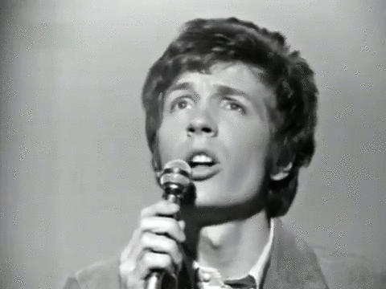
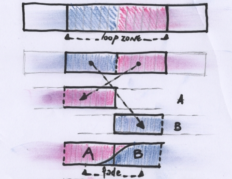
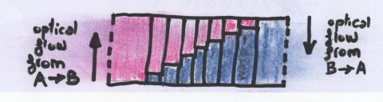
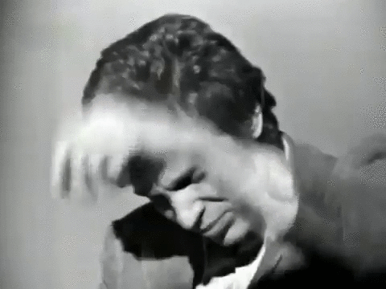

# video-loops

**automatic looping of image sequence using optical flow**

 - C++/[OpenCV] (> 4.2.0)
 - tested on Ubuntu 18.04 (KDE Neon)
 


**methodology :**

choose first and last frame of the loop (loop zone).
(to get invisible results they obviously must be as similar as possible).
cut in half and swap the 2 parts.
(the offensive cut is now in the middle of the loop).
fade A towards B around the middle frame.
(notice that you will use some frames before and after the loop)



**using opticalflow for the fade :** 

bidirectional opticalflow vector fields from pair frames of A/B are generated in .[flo] format.they are used to warp frameA to frameB and vice-versa.each warped frames are then blended , generating a flow driven morphing.



**Opticalflow methods :**

*OpenCV : implemented most of opencv proposed methods*
 -    ocv_deepflow
 -    farneback
 -    tvl1
 -    simpleflow
 -    sparsetodense
 -    rlof_epic
 -    rlof_ric
 -    pcaflow
 -    DISflow
 
I'm usually getting decent results with ocv_deepflow.(made it the default method).but sometimes it's worth trying with other methods.you can have good surprises...

*[deepflow]/[deepmatch]*

i'm usually getting the best morphing using deepflow/deepmatch method. I included the two static builds in this repository.they should work out of the box on Linux.(paths to executables are hardcoded in the code source , you should adjust it before compiling).you may need [libpng12].so.0 to run the deep statics on Ubuntu 18.04+.

beware that you should downscale your source images before using deepflow/deepmatch. I usually divide input resolution by 2 or 3.(see [flowscale] parameter) or it could take a loooong time to process and even crash.
 


**installation/compilation**

*my opencv install*

```sh
cd /yourpath/
wget -O opencv.zip https://github.com/opencv/opencv/archive/4.2.0.zip
wget -O opencv_contrib.zip https://github.com/opencv/opencv_contrib/archive/4.2.0.zip
unzip opencv.zip
unzip opencv_contrib.zip
cd /yourpath/opencv-4.2.0
mkdir build;cd build
cmake -D CMAKE_BUILD_TYPE=RELEASE \
  -D CMAKE_INSTALL_PREFIX=/yourpath/opencv-4.2.0_install \
  -D INSTALL_PYTHON_EXAMPLES=ON \ 
  -D INSTALL_C_EXAMPLES=ON \ 
  -D OPENCV_EXTRA_MODULES_PATH=/yourpath/opencv_contrib-4.0.1/modules \ 
  -DWITH_CUDA=ON -DWITH_QT=ON -DBUILD_opencv_cudacodec=OFF ..
make -j8
make install
```

edit CMakeLists.txt to match your installation path.

*clone and compile*

```sh
cd /yourpath/
git clone https://github.com/luluxxxxx/video-loops.git
cd video-loops
mkdir build
cd build
cmake ..
make
```
*usage :*

```sh
./looping inputdir framename extension loop_start loop_end loop_half_window
```

(note : loop_half_window = 3 will morph between -3,+3 frames around the center of the swaped loop)
i usually use 2 or 3 for half window.

downscaling your input is usually a good idea.faster and even sometimes better results as opticalflow can struggle with very large displacement.(made 0.5 as a default which is half resolution)

*make a loop*

```sh
./looping ../images lionwalk jpg 94 120 4
```

results should be in directory ./looping_lionwalk_94_120


i'm using this technique a lot in my experiments these days.you can see some results in my [twitter] feed.
i hope you can have some fun with it.
luluxXX

[flo]: <http://vision.middlebury.edu/flow/code/flow-code/>
[OpenCV]: <https://docs.opencv.org/4.2.0/d4/dee/tutorial_optical_flow.html>
[deepflow]: <https://thoth.inrialpes.fr/src/deepflow/>
[deepmatch]: <https://thoth.inrialpes.fr/src/deepmatching/>
[libpng12]: <https://launchpad.net/~ubuntu-security/+archive/ubuntu/ppa/+build/15108504/+files/libpng12-0_1.2.54-1ubuntu1.1_amd64.deb>
[twitter]: <https://twitter.com/luluixixix/status/1244663700482637835>

